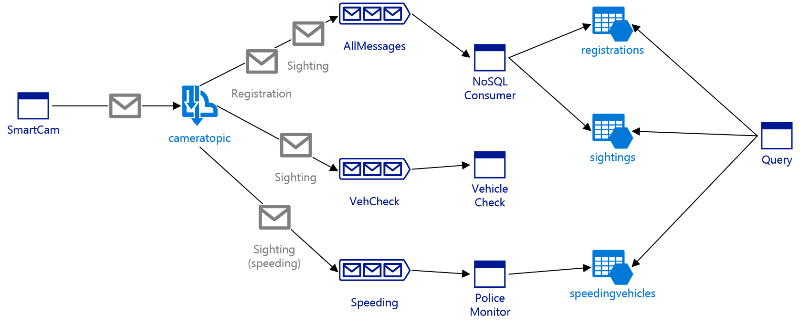
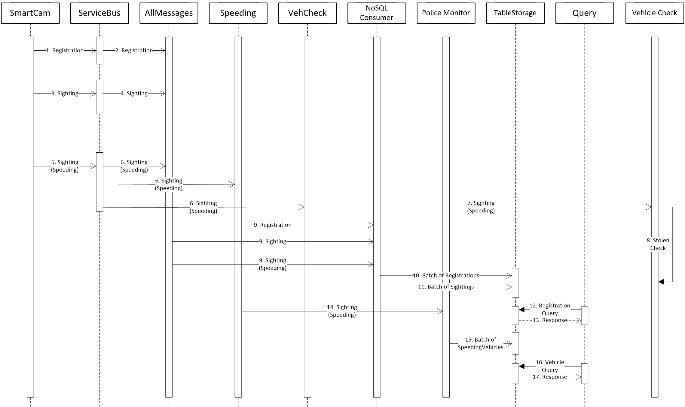
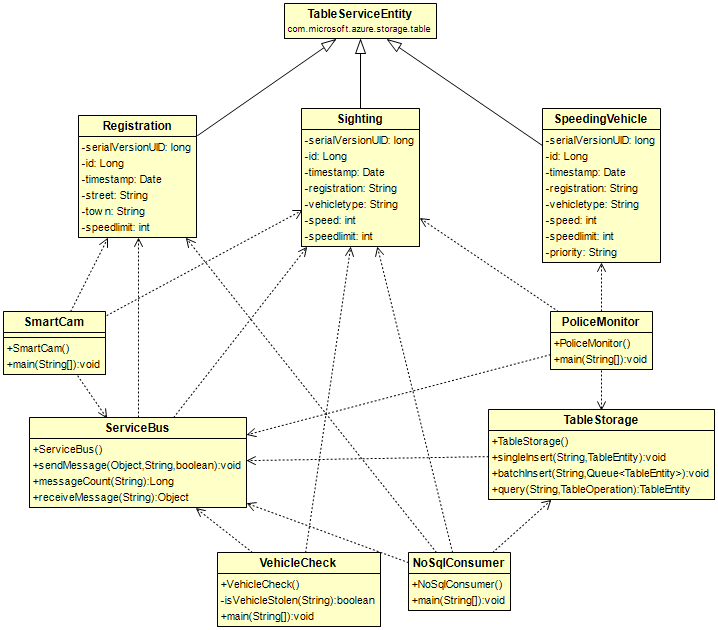

# Smart Camera Design

## Introduction

The coursework specification required the design and implementation of a (simulated) Smart Speed Camera application where camera messages are processed using Microsoft Azure&#39;s cloud services.

## High-level Design

**Figure 1: High-level Design**

The system uses Azure&#39;s Topic/Subscription messaging system and several worker applications that consume those messages, persisting them to Azure Table Storage.

Several instances of the **SmartCam** application simulate smart speed cameras, sending both **Registration** messages (on startup) and **Sighting** messages (during operation) to the Azure Topic **cameratopic**.  This topic has three subscriptions:

- **AllMessages** contains Registration and all Sighting messages
- **VehCheck** contains all Sighting messages where the vehicle was speeding
- **Speeding** contains Sighting messages where the vehicle was speeding

A different worker application consumes messages from each of these subscriptions.

**NoSQL Consumer** subscribes to AllMessages, and persists Registrations into a **registrations** table, and Sightings into a **sightings** table in Azure Table Storage.

**Police Monitor** subscribes to Speeding, adds a PRIORITY flag to any messages where the vehicle has exceeded the speed limit by at least 10%, then persists this to a **speedingvehicles** table in Azure Table Storage.

**Vehicle Check** subscribes to VehCheck, then simulates carrying out a lengthy stolen database check on each registration number.

Finally, there are a pair of **Query** applications that retrieve data from TableStorage.

**Figure 2: UML Sequence Diagram**

A UML Sequence Diagram for the system is above, showing how one SmartCam application interacts with the other processes.  Almost all the messages are asynchronous.

| Message(s) | Description |
| --- | --- |
| 1-2 | A speed camera registers with the system and the registration message is forwarded to the AllMessages subscription |
| 3-4 | After the speed camera is registered, it starts sending sighting messages which are forwarded to the AllMessages and VehCheck subscriptions |
| 5-6 | At some point the speed camera detects a speeding vehicle and sends a sighting(speeding) message which is forwarded to the AllMessages, Speeding and VehCheck subscriptions |
| 7-8 | The Vehicle Check process may begin consuming sightings from VehCheck and performing stolen vehicle checks after this point |
| 9 | The NoSQL Consumer process periodically polls AllMessages |
| 10-11 | The NoSQL Consumer process sends all the messages retrieved from AllMessages to TableStorage, in batches (see Implementation) |
| 12-13 | A query is performed on the registrations table |
| 14-15 | The Police Monitor process periodically polls Speeding and sends all messages in batches to TableStorage |
| 16-17 | A query is performed on vehicle data |

## Low-level Design

### Installation scripts

Setting up the Camera topic and subscriptions is normally a one-time operation, which suggested a lightweight scripting task.  I therefore chose to implement this with a Python script **CreateAzureServiceBus.py**.  I also implemented a series of scripts to test this initial installation and subscription message routing.

**SendTestAzureServiceBus.py**

**RecAllTestAzureServiceBus.py**

**RecVehCheckTestAzureServiceBus.py**

**RecSpeedingTestAzureServiceBus.py**

These send and consume simple text messages with custom properties for the subscription filters: messagetype (Registration or Sighting); and for Sighting messages, the additional custom property speeding (True or False).

Similarly to create the tables in Azure Table Storage, there is another Python script **CreateAzureTableStorage.py**.

### Applications

The more substantial applications i.e. SmartCam and the worker applications have been implemented in Java.

#### Azure API Layer

The Azure-specific implementation details have been contained in two classes ServiceBus and TableStorage to provide a level of decoupling between them and the application logic.  In theory this means less of the code needs to be modified if the system is ported to another Cloud provider (though this depends on the vendor providing similar functionality).

#### Message and Entity Layer

There are classes representing the Registration and Sighting messages which are serialised to JSON (being a structured String-based format that is more human-readable and smaller than XML).  These also inherit from the Microsoft TableServiceEntity class so that they may be persisted directly to Azure Table Storage.  SpeedingVehicle is not a message type but only used as a Table Storage entity.

See the Database Design later for more details.

**Figure 3: Simplified UML Entity Diagram**

#### SmartCam application

The ServiceBus sendMessage method adds messages to a queue if it is unable to contact the topic due to loss of internet connection.  A queue was chosen to preserve the order of the messages.  Next time sendMessage is called, then messages are first dequeued if possible before sending new messages.

#### NoSQL Consumer application

There is a requirement to minimise the number of costly API calls. Two approaches have been used.

To reduce the attempts to poll the AllMessages subscription unless there are several messages to retrieve, the application sleeps between polls.  This sleep time depends on the number of messages received at the last poll using a simple formula, so that if over 100 messages if received then there is no sleep time at all i.e. the application is not unnecessarily slowed.

Also, when inserting messages as entities into the NoSQL tables, they are inserted as batches.  A batch insert may insert up to 100 entities.

#### Police Monitor application

The Police Monitor application is similar to the NoSQL Consumer application, except that:

* It doesn&#39;t receive or persist any camera registration messages/entities
* It receives one message type (sighting) and converts it into a different entity type (speedingvehicle) before persisting it.

Otherwise Police Monitor uses the same technique as NoSQL Consumer to reduce API calls.

#### Vehicle Check application

The Vehicle Check application initially consumes the VehCheck subscription then calls a simulated check method which simply sleeps to provide a delay.  It does not use the same message batching system as NoSQL Consumer or Police Monitor.  To implement auto-scaling on queues, this application needs to be redesigned to use queues (see the later discussion on auto-scaling).

### Database design

#### Entities

There are three database entities: Registration, Sighting and SpeedingVehicle, described on the UML diagram in figure 3.  Registration contains all the fields relevant to a Speed camera registration, Sighting has the individual vehicle sighting details including the speed limit of the camera at the time, and also the RowKey of the speed camera Registration entity.  SpeedingVehicle has all the fields from Sighting, with the addition of the priority field to mark those vehicles speeding over 10% more than the limit.

I chose to keep the entities close to the message structure as set out in the coursework specification, keeping the design simple and avoiding duplication of data as is normal with SQL database design.  There appeared to be little purpose in persisting registration data into a separate table if that data was to be duplicated in the sighting table, and the specification implied that a programmatic join was expected to implement one of the queries.

In hindsight however, it may have been better if the Sighting entity, (and perhaps also the Sighting message) contained the full speed camera data i.e. if the data had been denormalised.  This would have had some advantages in implementing one of the Queries (see later).  There is a tradeoff between data storage requirements (and message sizes) and the efficiency of the queries and perhaps further discussion of the non-functional requirements would have indicated a preference for the denormalised design.

#### Partitions

The NoSQL tables entities require a Partition Key.  Entities on the same partition are always stored on the same server, but different partitions may be distributed.  The factors affecting the partitioning strategy for this application are:

- When inserting batches of entities, all entities must have the same Partition Key; therefore partitions should not contain too few entities for batching to be useful
- Queries should use as few partitions as possible for performance reasons
- The strategy should be scalable

The partition keys are as follows:

For _registrations_: Registration# where # is the camera id ÷ 10,000.  All registration messages from the same camera will appear in the same partition, and a numbering scheme may be devised so that all cameras in a city appear in the same partition up to a limit of 10,000 cameras per town/city.  The strategy is scalable by assigning new numbering ranges to new localities e.g.

| Area | Partition Key | Camera Id range |
| --- | --- | --- |
| A | Registration0 | 0-9999 |
| B | Registration1 | 10000-19999 |
| … | … | … |
| X | Registration10 | 100000-109999 |
| ... | … | … |

For vehicle _sightings_: SightingVehicle# where # is the vehicle&#39;s registration year.  All sightings for an individual vehicle will appear in the same partition, and the strategy is scalable as new partitions are created each year that new vehicles are registered.

### Queries

The queries are implemented in Python.

The query for all camera registrations is the script **CameraRegistrationsQuery.py.** This is reading the data into a Pandas Dataframe before displaying it, just for presentational reasons, though for a very large amount of data then perhaps it would be necessary to print out line by line.

The query for all sightings of priority speeding vehicles is **PriorityVehiclesQuery.py.**  It is assumed here that the requirement for &quot;priority speeding vehicles&quot; means for ALL priority speeding vehicles rather than selection of an individual one by registration number, though that would have been simple to implement with a filter on the query for SpeedingVehicles (easier, in fact).  The registration numbers are appended to a Python list to ensure uniqueness, then for each registration in that list another query is run against Sightings to find all sightings whether speeding or otherwise.

At this point the query needs to look at the speed camera details to get the street and town at the point of the sighting.  As there is no equivalent to SQL join, this can either be done with a query to the registration entity for each sighting record (which may result in unnecessary API calls) or by pre-fetching all the registration data and matching from an in-memory data structure (which may not be feasible if the data is very large).  I&#39;ve made the assumption that the data could be very large and gone with the former approach.  As mentioned in the database design section however, in hindsight a denormalised structure would have been much better _for this query_.

## Auto-scaling

Done:

* Created an additional VehCheck subscription for the Vehicle Check process to consume, and implemented that process.  It displays the message count after each check and demonstrates that the count continues to increase given any reasonable (or higher) rate of speeding messages being generated.

To do:

* Implement a new Java class to provide Azure queue send and receive methods.
* Create the queue with a new Python script.
* Update PoliceMonitor to forward all messages to that queue (PoliceMonitor currently uses the same methods as NoSQL Consumer to reduce the number of API calls, so it would not be adding messages to the queue at a constant rate, but would still be likely to overwhelm the queue without autoscaling).
* Update Vehicle Check to consume from the queue instead of the VehCheck subscription, which should then be removed.
* Create an auto-scaling availability set.
* Provision each VM in the availability set and have the Vehicle Check (and JRE) software installed on them individually.
* Create a rule linked to the queue in the Azure Portal on when to start up the VMs.